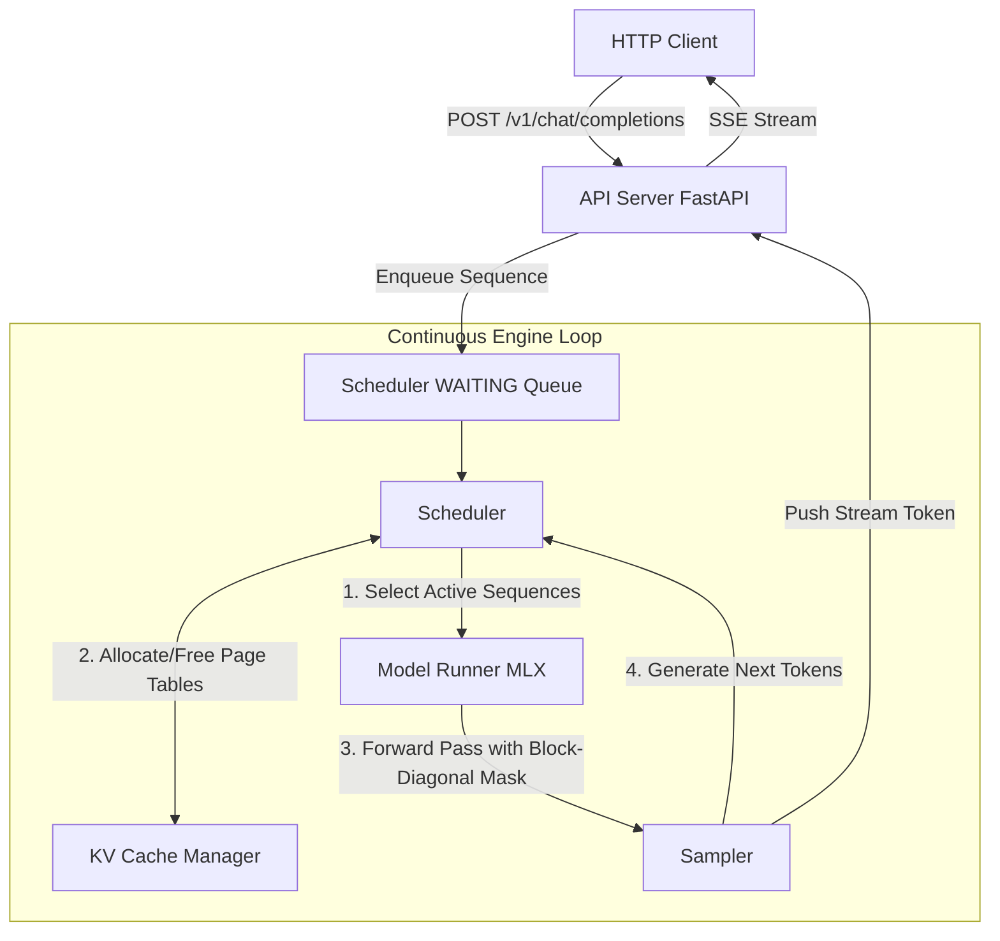

# Llama-MLX Continuous Batching Inference Server

[](https://developer.apple.com/metal/jax-pytorch-tensorflow/)
[](https://www.python.org/)
[](https://github.com/ml-explore/mlx)
[](https://platform.openai.com/docs/api-reference)

A high-throughput, continuous-batching LLM inference server designed natively for **Llama 3.1 / 3.2 (text-only)** on **Apple Silicon (macOS)**. Built directly on Apple's **MLX framework**, this server implements state-of-the-art multi-request serving infrastructure—including iteration-level scheduling, a paged KV cache, and token packing—optimized for the unified memory architecture of M-series chips.

---

## Core Architectural Pillars

* **Continuous Batching (Iteration-Level Scheduling):** Dynamically schedules and batches individual tokens at each forward pass, completely eliminating head-of-line blocking for mixed-length requests.
* **Paged KV Cache Manager:** Prevents memory fragmentation by decoupling logical sequence lengths from physical memory allocation. Allocates fixed-size physical cache blocks dynamically.
* **Token Packing with Block-Diagonal Masking:** Packs multi-sequence prefill and decode inputs into a single flat array for maximum compute saturation while strictly isolating sequence attention boundaries.
* **OpenAI-Compatible Engine:** Exposes an out-of-the-box REST API matching OpenAI’s chat and completion schemas, built with FastAPI and asynchronous Server-Sent Events (SSE) streaming.

---

## Architecture Overview

The execution pipeline decouples request acceptance, scheduling, tensor computation, and token generation to guarantee high hardware utilization.



---

## Component Detailed Specifications

### 1. Paged KV Cache Manager

The `BlockAllocator` pre-allocates a single contiguous memory pool upon initialization. A single physical block ID indexes into **all transformer layers simultaneously**, reducing lookup overhead.

* **Pool Tensor Shape:** `[num_blocks, num_layers, 2, num_kv_heads, block_size, head_dim]`
* **Block Sizing (Llama 3.1 8B example):** At `block_size = 16`, each block spans all 32 layers, keys, and values, evaluating to exactly:

$$\text{Block Size} = 32 \times 2 \times 8 \times 16 \times 128 \times 2 \text{ bytes} \approx 2.09 \text{ MB}$$


* **Sequence Allocation:** Each sequence object manages an ordered `block_table: list[int]` mapping logical pages to physical slots, tracking its exact write position via `num_kv_tokens % block_size`.

### 2. Iteration-Level Scheduler

Sequences transition through a deterministic finite state machine to maximize throughput while guaranteeing memory safety:

```
   WAITING ──► PREFILL ──► DECODE ──► FINISHED
                   │                     ▲
                   └──► PREEMPTED ───────┘
                            │
                            ▼
                         WAITING (Re-queued, Cache Evicted)

```

* **Admission Pre-allocation:** To minimize runtime check logic, newly admitted sequences are pre-allocated an extra block (`ceil((prompt_len + 1) / block_size)`), guaranteeing that the first decode step never triggers an out-of-memory exception during transition boundaries.
* **Preemption Strategy:** When cache pressure hits $100\%$, the scheduler preempts the lowest-priority active sequence (First-Come, First-Served eviction policy), freeing its block tables back to the allocator and re-queuing the sequence into `WAITING`.

### 3. Model Runner & Paged Attention

The `ModelRunner` serializes both prefill and decode sequences into a packed batch representation:

```python
@dataclass
class Batch:
    token_ids: list[int]          # Packed token array: [*prefill_seqs, *decode_tokens]
    positions: list[int]          # Absolute sequence positions for Rotary Position Embeddings (RoPE)
    block_tables: list[list[int]] # Per-sequence physical block tables
    seq_lens: list[int]           # Individual segment lengths within the packed array
    num_prefill_seqs: int         # Total prefill boundaries in this step

```

* **Attention Layer Execution:** Utilizes `mlx.core.fast.scaled_dot_product_attention` as its processing primitive. At each layer, K and V projections are scattered directly into their designated block/slot indices.
* **Gather & Masking:** The runner gathers historical blocks via the sequence block tables, concatenating them into a unified tensor. A **block-diagonal mask** forces query tokens to exclusively attend to their historical sequence bounds.

---

## Project Structure

```text
inference_server/
├── model/
│   ├── llama.py            # Llama 3.1 architectural implementation in MLX
│   ├── weights.py          # HuggingFace safetensors parsing & conversion
│   └── rope.py             # Pre-computed Rotary Position Embedding tables
├── engine/
│   ├── block_allocator.py  # Persistent pool allocation and free-list tracking
│   ├── sequence.py         # Sequence tracking & state transition machines
│   ├── scheduler.py        # Iteration-level sequence packing & preemptions
│   └── runner.py           # Batch compilation, attention scattering, & gather
├── sampling/
│   └── sampler.py          # Greedy, Top-P, and Top-K token selection
├── server/
│   ├── app.py              # FastAPI application & SSE routers
│   └── protocol.py         # Strictly validated OpenAI-compatible data schemas
├── config.py               # Central ServerConfig configurations
└── main.py                 # Core executable entrypoint

```

---
<!-- 
## Performance Targets (Llama 3.2 3B on M4 MacBook Pro)

| Performance Indicator | Operational Target |
| --- | --- |
| **Aggregate Throughput (Batch Size = 8)** | $\ge 400 \text{ tokens/sec}$ |
| **Time to First Token (TTFT)** | $\le 200 \text{ ms}$ (Prompts $\le 512$ tokens) |
| **Steady-State KV Cache Utilization** | $\ge 85\%$ under continuous synthetic load |
| **Infrastructure Memory Overhead** | $< 50 \text{ MB}$ (Excluding heavy tensor allocations) |

--- -->

## Configuration & Installation

### Prerequisites

* Apple Silicon Mac (M1/M2/M3/M4 generation)
* macOS 14.0 (Sonoma) or newer
* Python 3.10 or higher

### Setup

1. Clone the repository:
```bash
git clone [https://github.com/yourusername/llama-mlx-server.git](https://github.com/yourusername/llama-mlx-server.git)
cd llama-mlx-server

```


2. Install dependencies:
```bash
pip install -r requirements.txt

```


### Launching the Server

Configure the engine directly via execution flags or modify `config.py`:

```bash
python main.py \
  --model-path /path/to/Llama-3.1-8B-Instruct \
  --host 0.0.0.0 \
  --port 8000 \
  --block-size 16 \
  --max-num-blocks 2048 \
  --max-num-seqs 64 \
  --max-seq-len 8192 \
  --prefill-chunk-size 512

```

**Required Arguments:**
- `--model-path`: Path to the model weights (HuggingFace format)

**Optional Arguments (with defaults):**
- `--host` (default: `0.0.0.0`): Server bind address
- `--port` (default: `8000`): Server port
- `--block-size` (default: `16`): KV cache block size in tokens
- `--max-num-blocks` (default: `2048`): Maximum number of KV cache blocks
- `--max-num-seqs` (default: `64`): Maximum concurrent sequences
- `--max-seq-len` (default: `8192`): Maximum sequence length
- `--prefill-chunk-size` (default: `512`): Prefill chunk size for long prompts

---

## API Usage Examples

The engine exposes endpoints compatible with your existing toolchains (LangChain, LlamaIndex, OpenAI SDK, etc.).

### Chat Completions (Streaming)

```bash
curl -X POST http://localhost:8000/v1/chat/completions \\
  -H "Content-Type: application/json" \\
  -d '{
    "model": "llama-3.1-8b",
    "messages": [
      {"role": "system", "content": "You are a highly concise systems programming assistant."},
      {"role": "user", "content": "What are the performance advantages of a paged KV cache?"}
    ],
    "temperature": 0.7,
    "top_p": 0.9,
    "stream": true
  }'

```

---

## Engineering Roadmap (v2 Specifications)

* [x] **Chunked Prefill Execution:** Break down incoming massive prompts into configured block sizes (e.g., `prefill_chunk_size = 512`) to eliminate execution stalls and keep decode latency tightly bounded.
* [ ] **Unified Memory Cache Swapping:** Instead of discarding KV blocks and triggering full recomputation on preemption, take advantage of Apple Silicon's zero-copy architectures to swap inactive block slices into system RAM, restoring them instantaneously when rescheduled.
